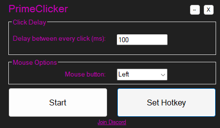

# Prime AutoClicker

This tool allows you to automate mouse clicking with customizable intervals, perfect for repetitive tasks and boosting productivity.

## Installation:
1. Download the latest release [here](https://github.com/PrimeMarket/autoclicker/releases/tag/autoclicker)
2. Run ```PrimeClicker.exe```


